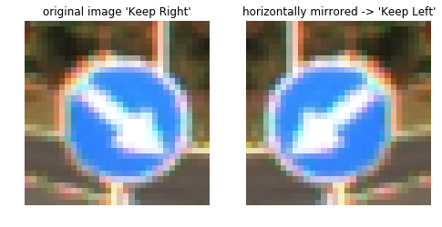

# **Traffic Sign Recognition** 

This project is MaxEtzo's submission for **Traffic Sign Classifier** aassignment which is a part of [**Self-Driving Car Engineer Nanodegree's**](https://eu.udacity.com/course/self-driving-car-engineer-nanodegree--nd013) by **Udacity**


**Build a Traffic Sign Recognition Project**
The goals of this project are the following:
* Load the [data set](https://s3-us-west-1.amazonaws.com/udacity-selfdrivingcar/traffic-signs-data.zip) (German Traffic Sign Benchmark Dataset)
* Explore, summarize and visualize the data set
* Design, train and test a model architecture
* Use the model to make predictions on new images
* Analyze the softmax probabilities of the new images
* Summarize the results with a written report 


## Rubric Points
### Here I will consider the [rubric points](https://review.udacity.com/#!/rubrics/481/view) individually and describe how I addressed each point in my implementation.  

### Dataset Summary & Exploration

#### 1. Basic summary of the dataset:

I used python's native `len` and numpy's `shape` methods to obtain the information on the datasets and the image format.
```python
n_train = len(y_train)
n_valid = len(y_valid)  
n_test = len(y_test)  
image_shape = X_train.shape[1:4]  
n_classes = len(set(y_train))
```

* The size of training set is 34799
* The size of the validation set is 4410
* The size of test set is 12630
* The shape of a traffic sign image is (32,32,3)
* The number of unique classes/labels in the data set is 43

#### 2. Exploratory visualization of the dataset.

Below are distribution histograms for training, validation and test sets respectively. 


All, training, validation, and test sets have relatively similar signs distribution. It must be noted that sets are biased toward certain signs. 

* Most frequent sign in training set - *'Speed limit (50km/h)'* with 2010 samples
* Least frequent sign in training set - *'Speed limit (20km/h)'* with 180 samples

Ratio of the most frequent sign to the least one is over 10! On the one hand, it's not an ideal situation as a model based on such dataset will be **biased (i.e. perform better) towards over-represented signs**. On the other hand, one may conclude that **these distributions represent real distributions of the signs on the roads**! In fact, in five years I have never encountered *'Speed limit (20km/h)'* sign in Germany. Whereas 30 and 50 km/h signs are common due to 'residential' and 'urban' speed limits regulations. Some people argue that datasets must be equalized in order to avoid biasing, and others going for integrity of the distribution solely for achieving higher accuracy. IMO, the golden line is somewhere in between. 

Let's have a look at the random samples for each sign class:


as can be observed, datasets comprise of images of wide range of quality. Some signs are hardly readable as they are either too dark, too bright and/or too blur. Also, in some samples signs are partially visually obstructed, covered with shadows, or contain parts of other signs.  

### Design and Test a Model Architecture
#### 1. Dataset augmentation.
We can further increase dataset by applying simple geometrical transformations. 
##### a. Symmetries: 
Certain signs are horizontally, vertically, diagonally (*-pi/4* and *pi/4*) and/or rotationally (*pi/2*, *pi*, *3pi/2*) symmetrical. For example, all aforementioned transformations can be applied to *'Priority road'* sign, while *'Bumpy road'* only horizontally symmetrical.


Certain sign pairs (typ. *'left-right'* type of signs) are horizontal mirrored copies. So by applying the horizontal flipping sample set of the counterpart sign can be extended.



*Note: I decided to apply only horizontal and vertical flipping, as other transformations will result in an extreme biasing (as rotations, diagonal symmetry, etc. are all typ. applicable to the same signs). Also, to avoid strong bias towards 'Priority Road', it is intentionally removed from horizontal symmetry group*

##### b. Perspective transformation:    
I used opencv's `warpPerspective` to further augment the dataset. I augmented dataset in such way as to reduce signs distribution non-uniformity (but not remove it completely): most frequent class is scaled by 2, least frequent by 16, else is linearly mapped in between.


##### c. + Gauss noise:
In order to further decorrelate new generated data from original gaussian noise on the former is applied. *(Note: it's important to clip the data between legal values after the noise is added)*


##### Final dataset:
Only training set was augmented (to validate and test upon original dataset).

* The size of augmented training set is 185418
* The size of the validation set is 4410
* The size of test set is 12630


As can be observed, we did quasi-uniform the training dataset and still preserve slight biasing towards most frequent signs.

#### 2. Data preprocessing 

##### a. Colorspace (RGB+I):
Many discussions in the web around advantages and disadvantages of different colorspaces for Convolutional Neural Networks. For example, [here](http://forums.fast.ai/t/rgb-vs-hsv-colorspace/1885/2), [here](https://www.reddit.com/r/MLQuestions/comments/6ueiis/hsv_vs_rgb_grayscale_for_convolutional_neural/), or [here](https://www.reddit.com/r/MLQuestions/comments/6rfpzj/does_the_color_basis_matter_in_a_cnn/). Originally, I was thinking about converting images to HSV space, however, I opted not to as HSV contains a nasty singularity around 0°/360° (Red). [The paper](http://yann.lecun.com/exdb/publis/pdf/sermanet-ijcnn-11.pdf) by Sermanet and LeCun uses YUV space, that compresses *color* information (same holds for HSV, btw). In my opinion colors (for humans) play a big role in recognizing traffic signs, and all three Red, Green (as part of yellow and white) and Blue are highly represented. So I decided to stick with RGB format and instead add grayscale as a 4th channel. 

As a grayscale channel I used a simple intensity, i.e. 1/3*(R+G+B), instead of Luma (corrected for human perception). As suggested by [this paper](https://www.ncbi.nlm.nih.gov/pmc/articles/PMC3254613/) there are no reasons why Luma would perform better than the plain Intensity (after all, after several epochs neural network train it's own sensitivity to different colors).

##### b. Clahe (histogram equalization):
The necessity of grayscale channel in the first place (H in HSV, or Y in YUV) is to improve contrast via histogram equalization for better pattern readability. Histogram equalization cannot be applied on color channels as it will modify color information. Hence, either images must be converted to HSV, YUV, etc. format, or as I did, added an extra channel with better patterns readibility. For histogram equalization I used opencv's `clahe.Apply` method with a tile of 4x4. 


##### c. Normalization:
Values are normalized between 0 and 1. It's done during reading the data from the pickle file. 

#### 3. Final model
My final model is depicted below:


Note that there are **ReLU activations** after each convolution and fully connected layers (other than the last) that are not shown on the diagram. **Last layer is activated with Softmax**. 

I started with a LeNet architecture that with a proper preprocessing can get you to 90-93 accuracy range. [The paper](http://yann.lecun.com/exdb/publis/pdf/sermanet-ijcnn-11.pdf) by Sermanet and LeCun feedforward the first stage features into second stage features. That inspired me to my architecture, where I added a second parallel pipeline with a bigger filter/tile (9x9) size. Purpose of 5x5 pipeline is to detect finer features / details, typ. in the center of signs (e.g. bicycle sign). While 9x9 pipeline detects courser features, such as the shape of the sign (circle, rectangular, etc). Hence the names are high- and low- resolution pipelines respectively. *(note that second stage of 9x9 pipeline also uses 5x5 tile, the difference is only in the first stage)*. Also, I added additional fully connected layer.

#### 4. Describe how you trained your model. The discussion can include the type of optimizer, the batch size, number of epochs and any hyperparameters such as learning rate.

##### Early stop based on moving average of validation accuracy
Since the model is trained via mini-batching, there is some noise in validation accuracy. In order to avoid early stop due to said noise, it is based on moving average (of 3) of validation accuracy, i.e. only if the *average* of the last 3 accuracies drop, then stop training. The best model is saved.

##### Regularization
Regularization is done via adding L2 loss of all weights to total loss function. `l2_reg` regularization weight of 0.00001 is chosen. Also, dropout of 0.5 is applied after each fully connected layer (not convolution layers and the last). 

##### Summary
* Optimizer = Adam
* Batch = 1024 (maximum that memory would allow me)
* Epochs = 100 (with early stop based on moving average of 3)
* Learning rate = 0.00005
* Loss function = cross_entropy + L2_loss(all weights)
* L2 regularization weight = 0.00001

#### 4. Results

My final model results:
* validation set accuracy of 0.958
* test set accuracy of 0.951

Model performed worse than I anticipated. I still believe with some tuning and tweaking the architecture can perform better.

### Test a Model on New Images
#### 1. New images
Here we will test a model on 5 new images taken from https://www.youtube.com/watch?v=_P-NZmjl5gM and display the results.


Second sign - *'Yield'* is facing in the opposite direction, so it can be recognized only via shape. Third sign - *'Stop'* is facing at an angle. Fifth sign - *'No stopping'* **is not presented in the original training dataset**.

#### 2. Predictions:

Here are the results of the prediction:

| Image			        |     Prediction	        					|   Probabilities               |
|:---------------------:|:---------------------------------------------:|:---------------------------------------------:| 
| Speed limit (30km/h)      		| Speed limit (30km/h)   									| 0.9781642             |
| Yield     			| Yield 										| 0.83698887             |
| Stop					| Stop											| 0.99874794             |
| Keep Right	      		| Keep Right					 				| 1.                   |
| No stopping			| Keep Left     							| 0.33641648            |


The model was able to correctly guess 4 of the 4 traffic signs presented in the original dataset, which gives an accuracy of 100%. Note that the fifth sign is not presented in the original training dataset.

#### 3. Softmax probabilities


As can be observed, *'Yield'* has a bit lower certainty than the others. In my opinion, its due to the fact that the sign is facing the opposite direction, and hence the color information is different. *'No stopping'* was recognized as *'Keep Left'* sign with *'Keep Right'* as being second best prediction. In my opinion, it's due to the same color of the middle area (blue), shape (circle), diagonal lines, and little white stripe near the bottom that is probably recognized as part of the arrow. Although the certainty is low, and that what we want to see when the model recognizes the sign that is never *seen* before. All other signs are recognized with high certainties.
